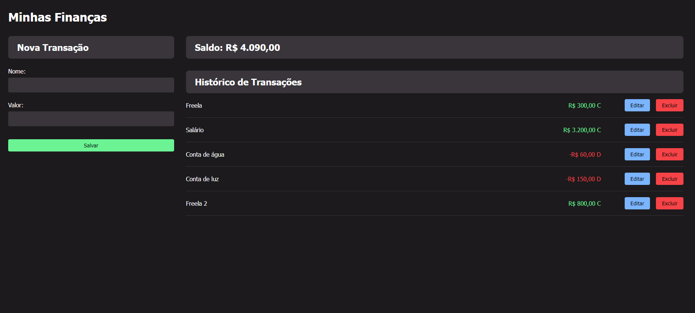

# My-Finances
💸 Take control of your finances

This is a simple transaction control project that allows the user to add, edit and delete transactions. Transactions are displayed in an interactive user interface, providing a clear view of financial history. The project uses standard web technologies such as HTML, CSS and JavaScript, and makes use of JSON Server to simulate a database.

## Technologies

- **HTML5:** Used for the basic structure of the page.
- **CSS3:** User interface styling for a pleasant visual experience.
- **JavaScript** (ES6+): Programming logic for manipulating the user interface and interacting with the server.
- **JSON Server:** Tool for simulating a RESTful database with JSON.
- **Node.js:** Platform that allows JavaScript to be executed on the server.

## How to Install and Start the Project

### Pre-requisites
- [Node.js](https://nodejs.org/): Make sure you have Node.js installed on your system.

### Steps

1. **Clone the Repository:**
   ```bash
   git clone https://github.com/rychardbarros/My-Finances.git
   cd My-Finances
   ```
2. **Install the dependencies:**
   ```bash
   npm install
   ```
3. **Start JSON Server:**
   ```bash
   npm run server
   ```
4. **Run the index.html file in your browser**

## Layout


## License 📚
[MIT license](LICENSE).

Made by [Rychard Barros](https://github.com/rychardbarros)
   

   
